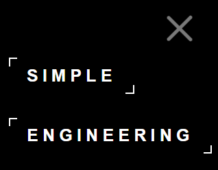
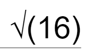

# Calculator description
This web application is designed for mathematical calculations. It is possible to choose between regular and engineering calculators, for this you need to click on the menu in the upper right corner of the calculator and select the desired calculator:

#### Menu button:   

#### Menu list:  

It is also possible to switch the theme, for this you can click on the following switch in the upper left corner:  
#### Theme switcher:

# Hints 
To find the square root or factorial of a number, you need to write the number in brackets, like this:  
#### Square root of a number:
  

#### Factorial of a number:
  

## Author: Lavka Oleksii